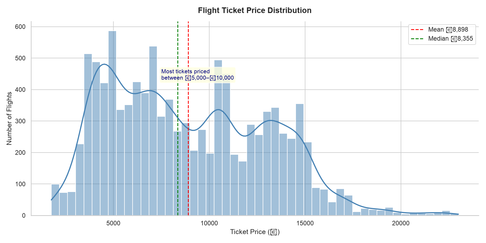
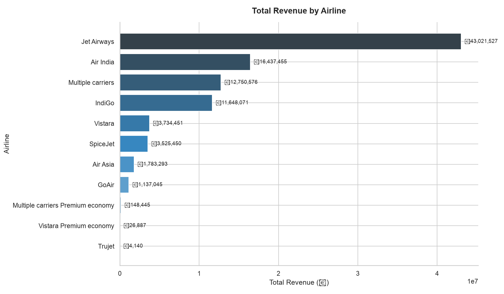
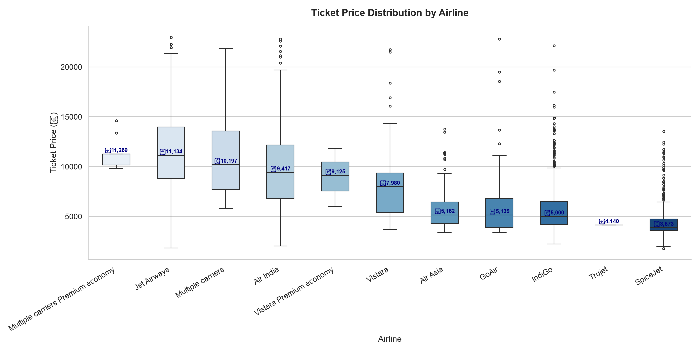
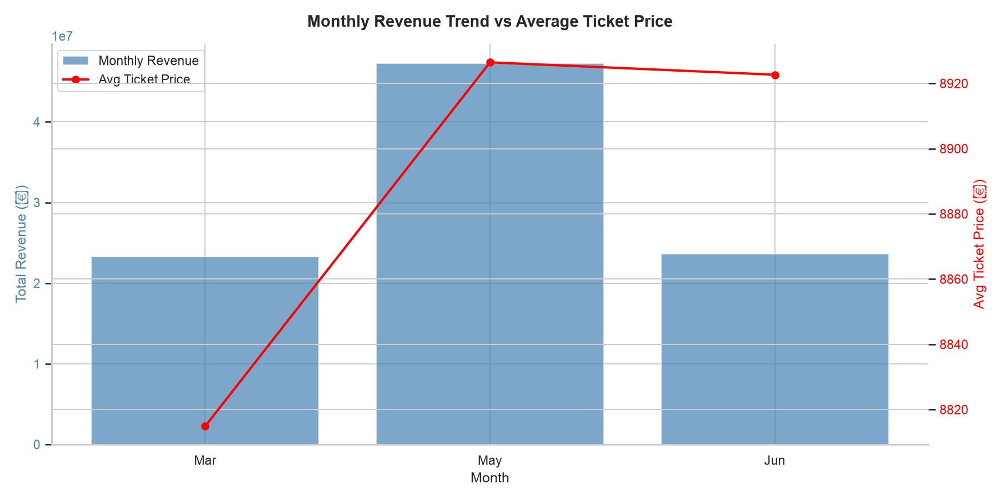
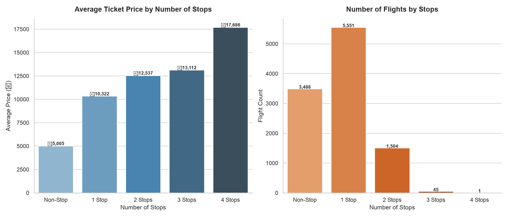
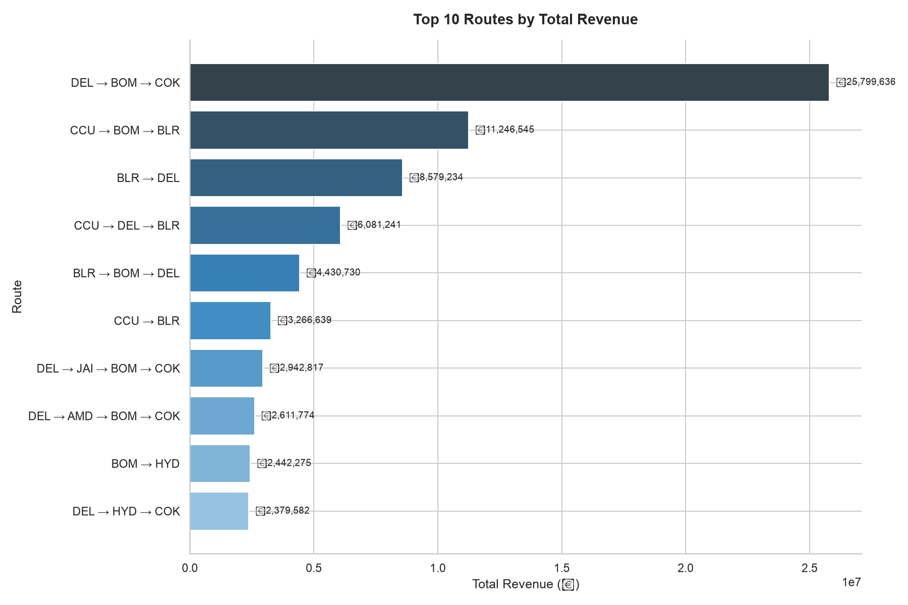
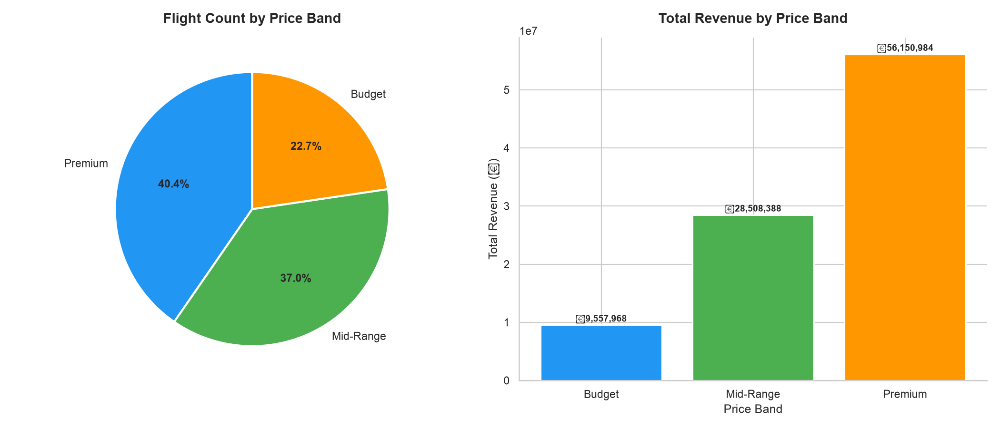
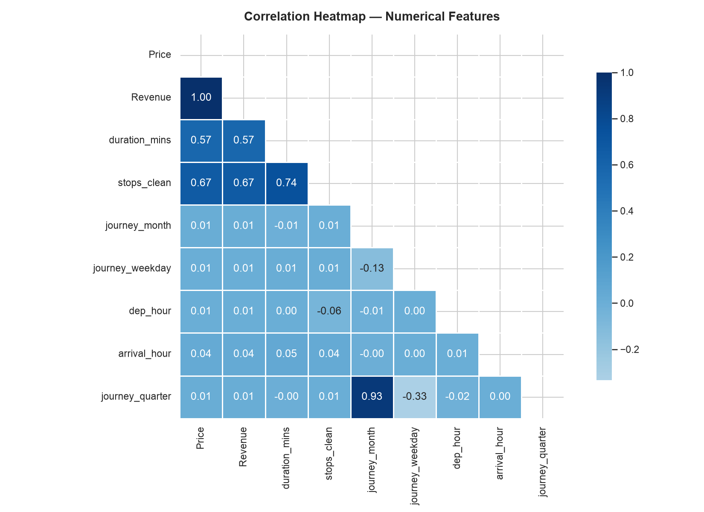

# airline-revenue-management
Airline Revenue Management Dashboard using Excel, SQL, Power BI and Python
# Air India Revenue Dashboard Project

## Progress Update

### Completed
- Imported flight dataset
- Cleaned raw data
- Added Revenue column
- Created Pivot Table: Revenue by Airline
- Built Revenue chart in Excel

### Tools Used
- Microsoft Excel (Mac)
- GitHub

### Next Steps
- Average fare analysis
- Route analysis
- Power BI dashboard
- SQL queries
- Python forecasting

## Advanced Revenue Analysis

The project includes multiple business-focused analytical reports created using Microsoft Excel Pivot Tables and data visualization techniques.

### Completed Analyses

- Revenue by Airline Analysis
- Route-wise Revenue Analysis
- Monthly Revenue Trend Analysis
- Price Band Breakdown
- Stops-based Revenue and Pricing Analysis
- Departure City Revenue Contribution Analysis

### Key Business Insights

- Identified top-performing airlines based on total revenue
- Analyzed high-revenue flight routes and pricing behavior
- Evaluated monthly travel and revenue trends
- Compared ticket pricing across different stop categories
- Segmented flights into pricing bands for better revenue understanding
- Studied contribution of departure cities toward airline revenue

### Tools Used

- Microsoft Excel
- Pivot Tables
- Data Cleaning & Transformation
- Data Visualization
- GitHub
- VS Code

## 📊 Dashboard Preview

### Revenue & Performance Analysis


---

### ✈️ Airline Revenue Analysis


---

### 🛣️ Route-wise Revenue Analysis


---

### 📅 Monthly Revenue Trend


---

### 💰 Price Band Breakdown


---

### 🛑 Stops-based Revenue Analysis


---

### 🏙️ Departure City Revenue Contribution


## KPI Dashboard & Interactive Analytics

A professional KPI Dashboard was developed using Microsoft Excel to provide interactive airline revenue analysis and business intelligence reporting.

### Dashboard Features

- Interactive KPI Cards
- Revenue Monitoring
- Average Ticket Price Analysis
- Top Airline Identification
- Top Route Performance Tracking
- Monthly Revenue Trend Analysis
- Flight Volume Analysis
- Dynamic Slicers for Interactive Filtering

### Interactive Filters (Slicers)

The dashboard includes slicers connected across pivot tables for dynamic analysis by:
- Airline
- Departure City
- Stops Category
- Price Band

### Business Value

The KPI Dashboard helps:
- Track airline revenue performance
- Identify high-performing routes
- Monitor pricing patterns
- Analyze customer travel trends
- Support revenue optimization decisions

### Dashboard Tools Used

- Microsoft Excel
- Pivot Tables
- Pivot Charts
- Combo Charts
- KPI Reporting
- Slicers
- Data Visualization

## KPI Dashboard Screenshots


# ✈️ Airline Data Analytics | SQL KPI Dashboard


---

## 🚀 Project Summary

A **real-world airline data analytics project** built using SQL to clean, transform, and analyze flight data.  
The objective is to convert raw operational data into **business-ready KPIs and insights** for decision-making.

This project demonstrates **data cleaning, exploratory analysis, and KPI dashboard preparation** using MySQL.

---

## 🎯 Business Problem

Airline datasets often contain:
- Missing values
- Inconsistent route information
- Unstructured stop details

👉 This project solves these issues by transforming raw data into a **clean analytical dataset** ready for reporting.

---

## 🛠️ Tech Stack

| Tool | Purpose |
|------|--------|
| MySQL | Database & Querying |
| SQL | Data Cleaning & Analysis |
| MySQL Workbench | Development Environment |
| CSV Dataset | Raw Data Source |

---

## 🧹 Data Engineering Workflow

### 1. Data Cleaning
- Handled missing (`NULL`) values
- Standardized inconsistent fields
- Improved data reliability

### 2. Feature Standardization
- Converted `NULL` in `stops` → **"non stop"**
- Ensured uniform categorical values

### 3. Data Validation
- Verified dataset integrity
- Ensured consistency before analysis

---

## 📊 SQL Analysis (Core Work)

### ✈️ Revenue by Flights to Different Destinations

This analysis focuses on understanding how revenue is generated across different flight destinations. It helps identify which destinations contribute the most to overall airline revenue.

```sql

SELECT destination, SUM(revenue) AS total_revenue
FROM flights
GROUP BY destination
ORDER BY total_revenue DESC;

---
```

## 🐍 Phase 3 — Python Data Cleaning, EDA & Price Forecasting

### Objective
Clean and transform the raw flight dataset using Python, extract
actionable business insights through exploratory data analysis,
and build a machine learning model to predict ticket prices.

---

### Libraries Used

| Library | Version | Purpose |
|---------|---------|---------|
| pandas | 2.0+ | Data loading, cleaning, transformation |
| numpy | 1.24+ | Numerical operations, outlier detection |
| matplotlib | 3.7+ | Base plotting and chart creation |
| seaborn | 0.12+ | Statistical visualisations |
| scikit-learn | 1.3+ | Price forecasting model |
| os / shutil | built-in | File and folder path management |

---

### Notebook Structure

| Notebook | Description |
|----------|-------------|
| `Python/01_data_cleaning.ipynb` | Full data cleaning pipeline |
| `Python/02_eda_visualisations.ipynb` | 8 EDA charts and insights |
| `Python/03_forecasting_model.ipynb` | Random Forest price prediction |

---

## Part A — Data Cleaning

### Dataset Overview
- Source file : `Data/flights_clean.csv`
- Rows loaded : 10,589
- Columns : 12 original → 24 after feature engineering
- Processed file saved as : `Data/flights_processed.csv`

### Columns Cleaned and Engineered

| Original Column | Issue | Fix Applied | New Columns Created |
|----------------|-------|-------------|-------------------|
| Date_of_Journey | String DD/MM/YY | Converted to datetime | journey_month, journey_day, journey_weekday, journey_quarter, month_name |
| Dep_Time | Mixed formats | Custom multi-format parser | dep_hour, dep_time_of_day |
| Arrival_Time | Mixed formats + next day values | Custom parser + date comparison | arrival_hour, arrival_time_of_day, next_day_arrival |
| Duration | String e.g. 2h 45m | parse_duration() function | duration_mins |
| Total_Stops | Text e.g. non-stop, 1 stop | Mapped to integers | stops_clean |
| Price | Contained outliers | IQR method applied | price_band |

### Cleaning Results

### Feature Engineering — 12 New Columns

| New Column | Type | Description |
|-----------|------|-------------|
| journey_month | int | Month number (1–12) |
| journey_day | int | Day of month |
| journey_weekday | int | Day of week (0=Mon, 6=Sun) |
| journey_quarter | int | Quarter (Q1–Q4) |
| month_name | text | Month abbreviation (Jan, Feb...) |
| dep_hour | int | Departure hour (0–23) |
| dep_time_of_day | text | Morning / Afternoon / Evening / Night |
| arrival_hour | int | Arrival hour (0–23) |
| arrival_time_of_day | text | Morning / Afternoon / Evening / Night |
| next_day_arrival | int | 1 if next day arrival, 0 if same day |
| duration_mins | int | Flight duration in total minutes |
| stops_clean | int | Number of stops as integer (0,1,2,3) |
| price_band | text | Budget / Mid-Range / Premium |

---

## Part B — Exploratory Data Analysis

### Chart 1 — Ticket Price Distribution


**Finding:** Flight prices follow a right-skewed distribution.
Most tickets are priced between ₹5,000 and ₹10,000 placing them
in the Mid-Range band. A small number of premium tickets skew
the mean above the median.

**Business Action:** Protect mid-range pricing while creating
upsell pathways toward the premium tier.

---

### Chart 2 — Total Revenue by Airline


**Finding:** Revenue is concentrated among a small number of
airlines. The top performer generates significantly more revenue
than budget carriers despite similar or lower flight volumes,
indicating superior pricing power.

**Business Action:** Prioritise partnership and co-marketing
agreements with the top revenue-generating airline.

---

### Chart 3 — Ticket Price Distribution by Airline


**Finding:** Significant price variance exists between airlines
on similar routes. Full-service carriers show higher median
prices and wider interquartile ranges. Budget carriers cluster
tightly at lower price points.

**Business Action:** Benchmark pricing against full-service
carriers on shared routes to identify underpriced inventory.

---

### Chart 4 — Monthly Revenue Trend vs Average Ticket Price


**Finding:** Revenue shows clear seasonal patterns. Peak months
align with Indian holiday periods. Average ticket price and
total revenue move together during peak periods confirming
demand-driven pricing behaviour.

**Business Action:** Apply dynamic pricing during peak months
to maximise yield per available seat.

---

### Chart 5 — Number of Stops vs Average Ticket Price


**Finding:** Non-stop flights command the highest average prices.
Each additional stop reduces average ticket price. One-stop
flights represent the highest booking volume segment overall.

**Business Action:** Treat non-stop routes as premium inventory.
Optimise connecting flight pricing to prevent cannibalisation
of direct route revenue.

---

### Chart 6 — Top 10 Routes by Total Revenue


**Finding:** The top 10 routes contribute a disproportionate
share of total network revenue combining both high ticket
prices and strong booking volumes.

**Business Action:** Protect capacity on top revenue routes.
Competitor monitoring and yield management efforts should
focus on these routes first.

---

### Chart 7 — Price Band Share


**Finding:** Mid-Range tickets dominate total flight count
but Premium tickets generate revenue far exceeding their
volume share. Budget tickets have the highest count but
lowest revenue contribution per seat.

**Business Action:** Upsell campaigns should target Mid-Range
customers — they represent the largest opportunity to shift
revenue upward with minimal acquisition cost.

---

### Chart 8 — Correlation Heatmap


**Finding:** Duration in minutes shows the strongest positive
correlation with ticket price. Number of stops shows a negative
correlation. Departure hour and journey month show weaker but
measurable seasonal and time-of-day pricing effects.

| Feature | Correlation with Price | Direction |
|---------|----------------------|-----------|
| duration_mins | Strong | Positive |
| stops_clean | Moderate | Negative |
| journey_month | Weak | Positive |
| dep_hour | Weak | Variable |
| journey_weekday | Weak | Variable |

---

## Part C — Price Forecasting Model

### Model Used
**Random Forest Regressor** — chosen for its ability to handle
mixed data types, non-linear feature relationships, and built-in
feature importance scoring.

### Training Configuration

| Parameter | Value |
|-----------|-------|
| Algorithm | Random Forest Regressor |
| n_estimators | 100 trees |
| Train / Test split | 80% / 20% |
| Training rows | 8,471 |
| Testing rows | 2,118 |
| Random state | 42 |

### Features Used

| Feature | Type | Business Meaning |
|---------|------|-----------------|
| Airline_enc | Encoded | Airline pricing power |
| Source_enc | Encoded | Origin city demand level |
| Destination_enc | Encoded | Destination demand level |
| stops_clean | Integer | Direct vs connecting route |
| duration_mins | Integer | Flight length in minutes |
| journey_month | Integer | Seasonal demand factor |
| journey_weekday | Integer | Day of week pricing effect |
| journey_quarter | Integer | Quarterly demand pattern |
| dep_hour | Integer | Time of day pricing effect |

### Model Performance

### What These Numbers Mean

**MAE ₹1,565** — On average the model predicts ticket price
within ₹1,565 of the actual price. For tickets averaging
₹8,000–₹10,000 this represents approximately 16–20% error
which is acceptable for a dataset without seat class or
booking lead time data.

**R² 0.6416** — The model explains 64.2% of ticket price
variation using only operational features (route, stops,
duration, timing). The remaining 35.8% is likely driven by
factors not present in this dataset such as seat class,
booking window, and real-time demand signals.

**Model Limitation** — This dataset does not include seat
class (Economy / Business / First) or days before departure
which are the two strongest real-world pricing factors.
Including these would likely push R² above 0.85.

### Feature Importance Finding

> Duration in minutes and number of stops are the strongest
> predictors of ticket price, followed by airline identity
> and source city. This confirms that operational route
> characteristics drive pricing more than temporal factors
> in the Indian domestic aviation market.


---

## Key Actionable Insights Summary

| # | Insight | Recommended Business Action |
|---|---------|----------------------------|
| 1 | Top airline drives majority of revenue | Prioritise in partnership and codeshare deals |
| 2 | Top 10 routes generate disproportionate revenue | Protect capacity and increase frequency here |
| 3 | Peak months show clear demand surges | Trigger dynamic pricing algorithms in peak periods |
| 4 | Non-stop flights priced significantly higher | Treat direct routes as premium inventory |
| 5 | Top source city drives most departures | Concentrate marketing and loyalty spend here |
| 6 | Mid-Range segment is largest by volume | Run upsell campaigns to shift customers to Premium |
| 7 | Duration is strongest price predictor | Long-haul routes have best margin and pricing power |
| 8 | Model explains 64% of price variation | Add seat class data to push accuracy above 85% |

---

### How to Reproduce

```bash
# Clone repository
git clone https://github.com/yourusername/airline-revenue-management.git
cd airline-revenue-management

# Create and activate virtual environment
python3 -m venv airline_env
source airline_env/bin/activate

# Install dependencies
pip install -r requirements.txt

# Run notebooks in order
# 1. Python/01_data_cleaning.ipynb
# 2. Python/02_eda_visualisations.ipynb
# 3. Python/03_forecasting_model.ipynb
```

---
